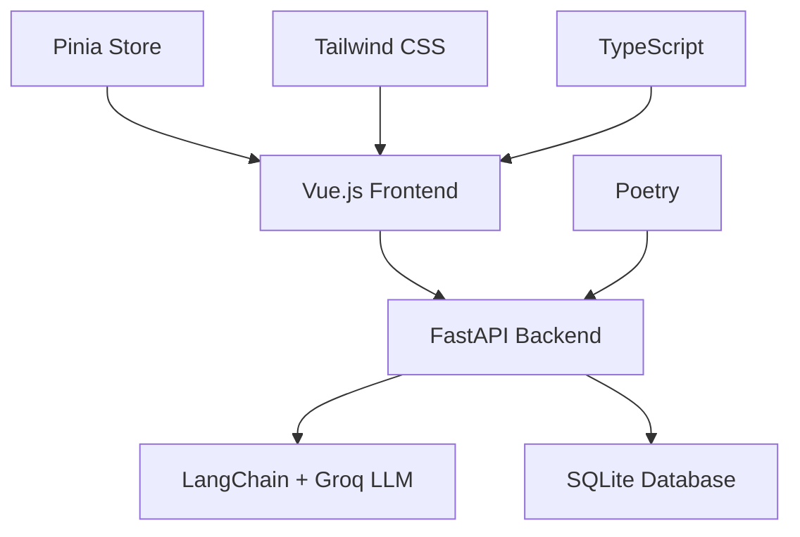

# 🎭 Faceless Agent

[](https://www.typescriptlang.org/)
[](https://vuejs.org/)
[](https://fastapi.tiangolo.com/)
[](https://www.python.org/)
[](https://tailwindcss.com/)
[](https://python-poetry.org/)

A sophisticated **persona-shifting AI chat agent** powered by Groq's LLM and built with modern web technologies. Create unique AI personalities with depth, engage in dynamic conversations, and experience AI like never before.

---

## ✨ Features

### 🎨 **Advanced Persona Generation**
- **🎲 Quick Generate**: Instant random personas from 30+ pre-loaded characters
- **⚡ Advanced Mode**: Category-based generation with trait customization
- **📝 Template System**: Pre-built sophisticated personas with detailed backgrounds
- **🏗️ Custom Creation**: Build your own unique personas with detailed descriptions

### 🎭 **Persona Categories**
| Category | Description | Examples |
|----------|-------------|----------|
| 🏛️ **Historical** | Characters from different eras | Victorian inventor, Medieval bard |
| 🧙‍♂️ **Fantasy** | Magical and mythical beings | Grumpy wizard, Ancient dragon |
| 🚀 **Sci-Fi** | Futuristic and technological | Time traveler, AI chef |
| 💼 **Professional** | Career-focused personas | Detective, Scientist |
| 🎨 **Creative** | Artistic and imaginative | Poet, Musician, Artist |
| 🤪 **Quirky** | Unique and eccentric | Conspiracy theorist alien, Zen robot |

### 🛡️ **Dual Chat Modes**
- **🛡️ Regular Mode**: Family-friendly, filtered responses
- **🔥 Uncensored Mode**: Creative, unfiltered conversations

### 🌙 **Modern UI/UX**
- **Dark/Light Theme**: Automatic system detection with manual toggle
- **Responsive Design**: Perfect on desktop, tablet, and mobile
- **Real-time Chat**: Smooth, instant messaging experience
- **Chat Export**: Download conversation history as text files

---

## 🏗️ Architecture



### **Frontend Stack**
- **Vue.js 3** with Composition API
- **TypeScript** for type safety
- **Tailwind CSS** for styling
- **Pinia** for state management
- **Vite** for development and building

### **Backend Stack**
- **FastAPI** for high-performance API
- **LangChain** for AI orchestration
- **Groq** for lightning-fast LLM inference
- **SQLite** for persona storage
- **Poetry** for dependency management

---

## 🚀 Quick Start

### Prerequisites
- **Node.js** 18+ and npm/yarn
- **Python** 3.10+
- **Poetry** for Python dependency management
- **Groq API Key** (free at [console.groq.com](https://console.groq.com))

### 1. Clone and Setup
```bash
git clone https://github.com/yourusername/faceless-agent.git
cd faceless-agent

# Install Poetry if you haven't already
curl -sSL https://install.python-poetry.org | python3 -
```

### 2. Environment Configuration
```bash
# Copy environment template
cp .env.sample .env

# Edit .env and add your Groq API key
GROQ_API_KEY=your_groq_api_key_here
```

### 3. Start Backend
```bash
# Using the convenient script
./start-backend.sh

# Or manually
cd backend && poetry install && poetry run start
```

### 4. Start Frontend
```bash
cd frontend
npm install
npm run dev
```

### 5. Open Application
- **Frontend**: http://localhost:5173
- **Backend API**: http://localhost:8000
- **API Documentation**: http://localhost:8000/docs

---

## 🎮 Usage Guide

### Creating Personas

#### **Quick Generate**
1. Click **"🎲 Quick Generate"** for instant random persona
2. Start chatting immediately

#### **Advanced Mode**
1. Select **"Advanced"** tab
2. Choose a category (Historical, Fantasy, etc.)
3. Pick optional traits (wise, mystical, sarcastic, etc.)
4. Click **"✨ Generate Advanced Persona"**

#### **Template Mode**
1. Select **"Templates"** tab
2. Browse pre-built sophisticated personas
3. Click on any template to activate

#### **Custom Personas**
1. Write detailed persona description
2. Click **"🚀 Use Now"** for immediate use
3. Or **"💾 Add to Library"** to save for later

### Chat Features
- **Mode Toggle**: Switch between Regular 🛡️ and Uncensored 🔥 modes
- **Export Chat**: Download conversation as `.txt` file
- **Clear Chat**: Reset conversation while keeping persona
- **Theme Toggle**: Switch between light ☀️ and dark 🌙 themes

---

## 🛠️ Development

### Frontend Development
```bash
cd frontend

# Start development server
npm run dev

# Build for production
npm run build

# Run tests
npm run test

# Lint code
npm run lint
```

### Backend Development
```bash
cd backend

# Install dependencies
poetry install

# Start development server
poetry run start

# Run tests
poetry run pytest

# Format code
poetry run black .

# Type checking
poetry run mypy .
```

### Development Scripts
```bash
# Backend development helper
./dev.sh dev          # Start development server
./dev.sh format       # Format code with Black and isort
./dev.sh lint         # Run linting (flake8 and mypy)
./dev.sh test-cov     # Run tests with coverage
./dev.sh add <pkg>    # Add new dependency
```

---

## 📁 Project Structure

```
faceless-agent/
├── 📄 README.md              # Project documentation
├── 🔧 .env.sample            # Environment template
├── 🚀 start-backend.sh       # Backend startup script
├── 🛠️ dev.sh                # Development helper
├── 📁 backend/               # Python FastAPI backend
│   ├── 📝 pyproject.toml     # Poetry configuration
│   ├── 📁 app/               # Application code
│   │   ├── 🐍 main.py        # FastAPI application
│   │   ├── 🗄️ database.py    # Database operations
│   │   ├── 🤖 chat_service.py # AI chat logic
│   │   └── 📋 models.py      # Pydantic models
│   └── 🧪 tests/             # Backend tests
├── 📁 frontend/              # Vue.js frontend
│   ├── 📦 package.json       # Node dependencies
│   ├── 📁 src/               # Source code
│   │   ├── 🎨 App.vue        # Main application
│   │   ├── 📁 components/    # Vue components
│   │   ├── 🏪 stores/        # Pinia stores
│   │   ├── 🔧 services/      # API services
│   │   └── 📝 types/         # TypeScript types
│   └── 🧪 tests/             # Frontend tests
├── 📁 docker/                # Docker configuration
└── 📁 docs/                  # Additional documentation
```

---

## 🎯 API Endpoints

### Persona Management
- `GET /generate_persona` - Generate random persona
- `GET /personas` - List all personas
- `POST /add_persona` - Add custom persona
- `DELETE /personas/{id}` - Delete custom persona

### Chat Operations
- `POST /chat` - Send message and get AI response
- `GET /health` - Health check

### System
- `GET /` - Root endpoint
- `GET /docs` - Interactive API documentation

---

## 🧪 Testing

### Backend Tests
```bash
cd backend
poetry run pytest -v                    # Run all tests
poetry run pytest --cov=app            # With coverage
poetry run pytest tests/test_api.py    # Specific test file
```

### Frontend Tests
```bash
cd frontend
npm run test              # Run all tests
npm run test:ui          # Test with UI
npm run test:coverage    # With coverage
```

---

## 🐳 Docker Deployment

```bash
# Build and run with Docker
docker-compose up --build

# Run in production mode
docker-compose -f docker-compose.prod.yml up
```

---

## 🔧 Configuration

### Environment Variables
| Variable | Description | Default |
|----------|-------------|---------|
| `GROQ_API_KEY` | Groq API key (required) | - |
| `VITE_API_BASE_URL` | Frontend API base URL | `http://localhost:8000` |
| `DATABASE_URL` | SQLite database path | `sqlite:///./chat_app.db` |
| `SECRET_KEY` | Application secret key | - |

### Model Configuration
- **Model**: `llama-3.1-8b-instant` (Groq)
- **Temperature**: 0.7 (adjustable in chat service)
- **Max Tokens**: 1024

---

## 🤝 Contributing

1. **Fork** the repository
2. **Create** a feature branch (`git checkout -b feature/amazing-feature`)
3. **Commit** your changes (`git commit -m 'Add amazing feature'`)
4. **Push** to the branch (`git push origin feature/amazing-feature`)
5. **Open** a Pull Request

### Code Style
- **Backend**: Black, isort, flake8, mypy
- **Frontend**: ESLint, Prettier
- **Commits**: Conventional commits preferred

---

## 📜 License

This project is licensed under the **MIT License** - see the [LICENSE](LICENSE) file for details.

---

## 🙏 Acknowledgments

- **[Groq](https://groq.com/)** for lightning-fast LLM inference
- **[LangChain](https://langchain.com/)** for AI application framework
- **[FastAPI](https://fastapi.tiangolo.com/)** for the excellent Python web framework
- **[Vue.js](https://vuejs.org/)** for the reactive frontend framework
- **[Tailwind CSS](https://tailwindcss.com/)** for utility-first styling

---

## 📧 Support

- **Issues**: [GitHub Issues](https://github.com/yourusername/faceless-agent/issues)
- **Discussions**: [GitHub Discussions](https://github.com/yourusername/faceless-agent/discussions)
- **Email**: your.email@example.com

---

<div align="center">

**Built with ❤️ for the AI community**

[⭐ Star this repo](https://github.com/yourusername/faceless-agent) • [🐛 Report Bug](https://github.com/yourusername/faceless-agent/issues) • [✨ Request Feature](https://github.com/yourusername/faceless-agent/issues)

</div>
